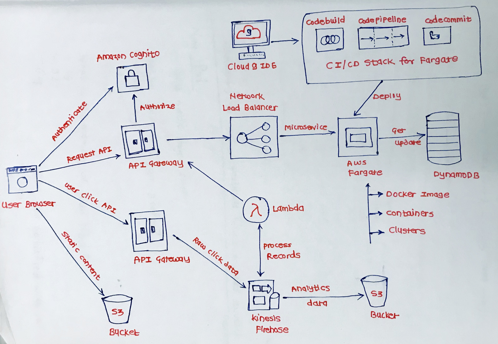

# AWS Based Modern Web Application (REST API and Microservices)

### Application Architecture

This application serves it's static content directly from Amazon S3, 
** Provides a microservice API backend deployed as a container through AWS Fargate on Amazon ECS, 
** Stores data in a managed NoSQL database provided by Amazon DynamoDB,
** Authentication and authorization for the application enabled through AWS API Gateway and it's integration with Amazon Cognito.  
** The user website clicks will be sent as records to an Amazon Kinesis Firehose Delivery stream
** Records will be processed by serverless AWS Lambda functions and then stored in Amazon S3.

** Creating and deploying changes to this application completely programmatically. 
** Will use the AWS Command Line Interface to execute commands that create the required infrastructure components, which includes a fully managed CI/CD stack utilizing AWS CodeCommit, CodeBuild, and CodePipeline.  
** Finally, you will complete the development tasks required all within your own browser by leveraging the cloud-based IDE, AWS Cloud9.

**Services used:**
* [AWS CloudFormation](https://aws.amazon.com/cloudformation/)
* [AWS Identity and Access Management (IAM)](https://aws.amazon.com/iam/)
* [Amazon Virtual Private Cloud (VPC)](https://aws.amazon.com/vpc/)
* [Amazon Elastic Load Balancing](https://aws.amazon.com/elasticloadbalancing/)
* [Amazon Elastic Container Service (ECS)](https://aws.amazon.com/ecs/)
* [AWS Fargate](https://aws.amazon.com/fargate/)
* [AWS Elastic Container Registry (ECR)](https://aws.amazon.com/ecr/)
* [Amazon DynamoDB](https://aws.amazon.com/dynamodb/)
* [Amazon Cognito](http://aws.amazon.com/cognito/)
* [Amazon API Gateway](https://aws.amazon.com/api-gateway/)
* [Amazon Simple Storage Service (S3)](https://aws.amazon.com/s3/)
* [AWS Kinesis Data Firehose](https://aws.amazon.com/kinesis/data-firehose/)
* [AWS Lambda](https://aws.amazon.com/lambda/)
* [AWS CodeCommit](https://aws.amazon.com/codecommit/)
* [AWS CodePipeline](https://aws.amazon.com/codepipeline/)
* [AWS CodeDeploy](https://aws.amazon.com/codedeploy/)
* [AWS CodeBuild](https://aws.amazon.com/codebuild/)
